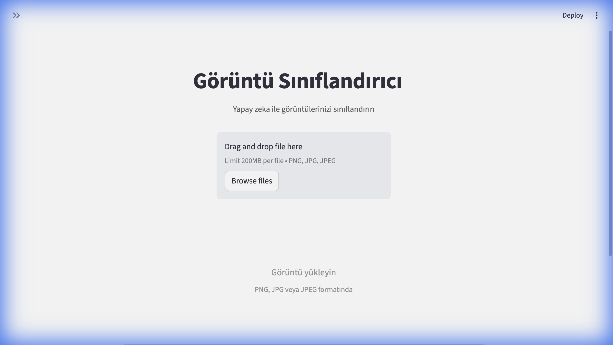
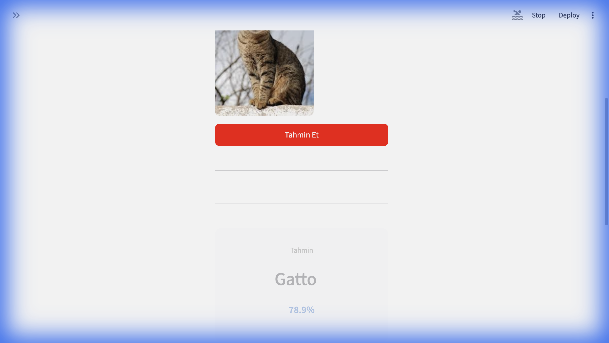
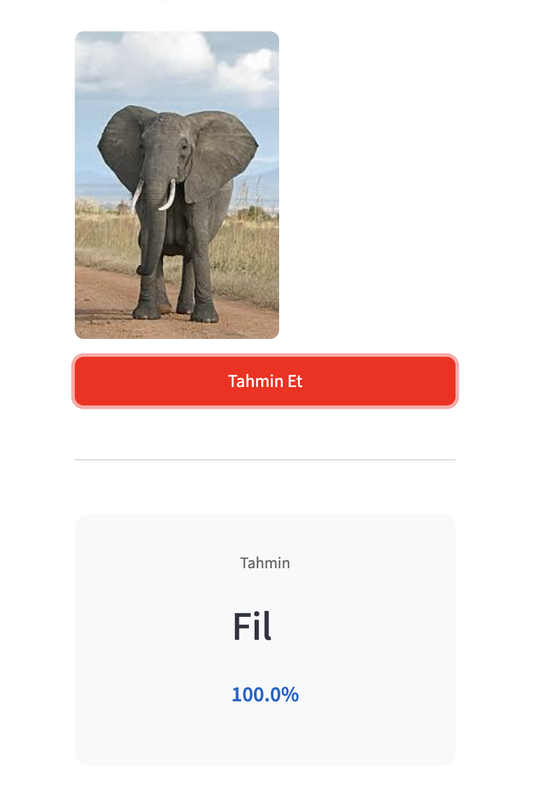
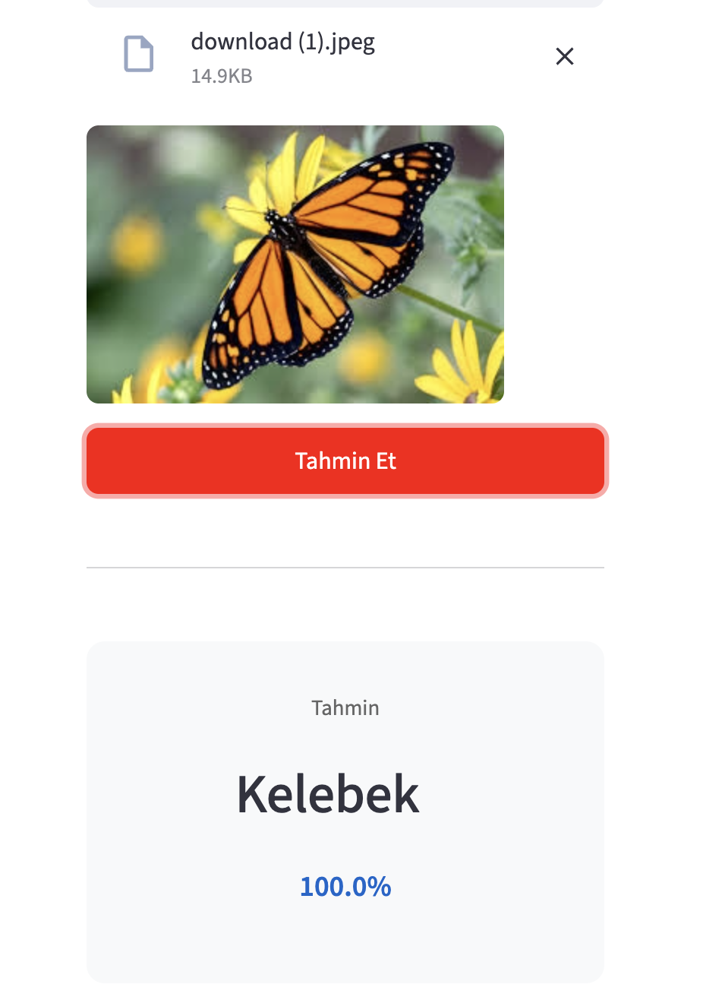

# Yapay Zeka Destekli Görüntü Sınıflandırıcı

Bu proje, PyTorch kullanarak görüntü sınıflandırma yapan bir yapay zeka uygulamasıdır. ResNet18 modeli ile transfer learning kullanılarak geliştirilmiş olup, Streamlit ile basit bir web arayüzü sunmaktadır.

## Özellikler

- Kullanıcılar bilgisayarlarından görüntü yükleyebilir
- Görüntüler otomatik olarak normalize edilir ve yeniden boyutlandırılır
- Transfer learning ile eğitilmiş ResNet18 modeli kullanılır
- En yüksek 5 tahmin olasılık değerleriyle gösterilir
- Streamlit ile kullanıcı dostu web arayüzü

## Kurulum

### Gereksinimler

- Python 3.8+
- CUDA destekli GPU (opsiyonel, CPU da çalışır)

### Adımlar

1. **Repository'yi klonlayın:**
```bash
git clone https://github.com/erdinat/computervision.git
cd computervision/GoruntuSiniflandirici
```

2. **Sanal ortam oluşturun (önerilir):**
```bash
python -m venv venv
source venv/bin/activate  # Linux/Mac
# veya
venv\Scripts\activate  # Windows
```

3. **Gerekli paketleri yükleyin:**
```bash
pip install -r requirements.txt
```

## Kullanım

### Web Arayüzünü Çalıştırma

1. **Model dosyasını hazırlayın:**
   - Model dosyası `models/best_model.pth` konumunda olmalıdır
   - Veya sidebar'dan farklı bir yol belirtebilirsiniz

2. **Streamlit uygulamasını başlatın:**
```bash
streamlit run app.py
```

3. **Tarayıcıda açın:**
   - Uygulama otomatik olarak `http://localhost:8501` adresinde açılacaktır

### Arayüz Kullanımı

1. **Görüntü Yükleme:**
   - Sol panelden "Bir görüntü seçin" butonuna tıklayın
   - PNG, JPG veya JPEG formatında bir görüntü seçin

2. **Tahmin Yapma:**
   - "Tahmin Et" butonuna tıklayın
   - Sonuçlar sağ panelde gösterilecektir

3. **Model Ayarları:**
   - Sidebar'dan model yolu ve sınıf sayısını ayarlayabilirsiniz
   - Sınıf isimlerini virgülle ayırarak girebilirsiniz

### Ekran Görüntüleri

#### Uygulama Arayüzü


#### Tahmin Örnekleri

**Kedi Tahmini:**


**Fil Tahmini:**


**Kelebek Tahmini:**


### Demo Video

Uygulamanın kullanımını gösteren kısa video: [Demo Video](screenshots/demo_video.mov)

## Proje Yapısı

```
GoruntuSiniflandirici/
│
├── data/                   # Veri setlerinin duracağı klasör
│   ├── train/              # Eğitim görüntüleri
│   └── test/               # Test görüntüleri
│
├── models/                 # Eğitilen modellerin (.pth) kaydedileceği yer
│   └── best_model.pth
│
├── screenshots/            # Uygulama ekran görüntüleri
│   ├── arayuz_ilk_sayfa.png
│   └── tahmin_sonucu.png
│
├── src/                    # Kaynak kodlar (Core logic)
│   ├── __init__.py
│   ├── preprocess.py       # Ön işleme sınıfları
│   ├── model_loader.py     # Model mimarisi ve yükleme fonksiyonları
│   └── trainer.py          # Eğitim döngüsü
│
├── app.py                  # Streamlit arayüz dosyası
├── train.py                # Model eğitim scripti
├── requirements.txt        # Gerekli kütüphaneler
└── README.md               # Dokümantasyon
```

## Model Eğitimi

### Veri Seti Hazırlama

1. **Veri setini indirin:**
   - [Fruits 360 Dataset](https://www.kaggle.com/datasets/moltean/fruits)
   - [Animals-10 Dataset](https://www.kaggle.com/datasets/alessiocorrado99/animals10)
   - [CIFAR-10 Dataset](https://www.cs.toronto.edu/~kriz/cifar.html)

2. **Veri yapısını oluşturun:**
```
data/
├── train/
│   ├── class1/
│   │   ├── img1.jpg
│   │   └── img2.jpg
│   └── class2/
│       ├── img1.jpg
│       └── img2.jpg
└── test/
    ├── class1/
    └── class2/
```

### Eğitim Scripti

`train.py` dosyasını kullanarak modeli eğitebilirsiniz:

```bash
python train.py --data_dir data --epochs 10 --batch_size 32
```

Eğitim parametreleri:
- `--data_dir`: Veri dizini yolu
- `--epochs`: Epoch sayısı (varsayılan: 10)
- `--batch_size`: Batch boyutu (varsayılan: 32)
- `--learning_rate`: Öğrenme oranı (varsayılan: 0.001)
- `--model_save_path`: Model kayıt yolu (varsayılan: models/best_model.pth)

## Teknik Detaylar

### Model Mimarisi

- **Backbone**: ResNet18 (ImageNet pretrained)
- **Transfer Learning**: Önceden eğitilmiş ağırlıklar kullanılır
- **Classifier Head**: 
  - Dropout (0.5)
  - Linear (512)
  - ReLU
  - Dropout (0.3)
  - Linear (num_classes)

### Ön İşleme

- **Boyutlandırma**: 224x224 piksel
- **Normalizasyon**: ImageNet standartları (mean=[0.485, 0.456, 0.406], std=[0.229, 0.224, 0.225])
- **Augmentation** (Eğitim için):
  - Random Crop
  - Random Horizontal Flip
  - Color Jitter (brightness, contrast, saturation, hue)

### Optimizasyon

- **Optimizer**: Adam
- **Learning Rate**: 0.001 (başlangıç)
- **Scheduler**: StepLR (her 5 epoch'ta 0.1 ile çarpılır)
- **Loss Function**: CrossEntropyLoss

## Değerlendirme Metrikleri

Model performansı şu metriklerle ölçülür:

- **Accuracy**: Genel doğruluk oranı
- **Precision**: Kesinlik (weighted average)
- **Recall**: Duyarlılık (weighted average)
- **F1-Score**: Precision ve Recall'un harmonik ortalaması

### Eğitim Sonuçları

Model, Animals-10 veri setinin 5 sınıfı (fil, kelebek, kedi, koyun, örümcek) üzerinde eğitilmiştir.

**Veri Seti İstatistikleri:**
- Eğitim örnekleri: 1,573
- Test örnekleri: 397
- Sınıf sayısı: 5

**En İyi Model Performansı (Epoch 2):**

| Metrik | Değer |
|--------|-------|
| **Training Accuracy** | 79.02% |
| **Validation Accuracy** | **86.15%** |
| **Precision** | 87.73% |
| **Recall** | 86.15% |
| **F1-Score** | 86.03% |

**Eğitim İlerlemesi:**

| Epoch | Train Loss | Train Acc | Val Loss | Val Acc | Precision | Recall | F1-Score |
|-------|------------|-----------|----------|---------|-----------|--------|----------|
| 1 | 0.7789 | 74.51% | 1.5105 | 57.18% | 67.18% | 57.18% | 53.95% |
| 2 | 0.5623 | 79.02% | 0.3835 | **86.15%** | **87.73%** | 86.15% | 86.03% |

Model, transfer learning (ResNet18, ImageNet pretrained) kullanarak başarılı bir şekilde eğitilmiştir. Validation accuracy'de %86.15'e ulaşılması, modelin yeni görüntüleri sınıflandırmada oldukça başarılı olduğunu göstermektedir.

## Kullanılan Veri Setleri

Proje şu veri setleriyle test edilmiştir:

1. **Fruits 360**: 130+ meyve sınıfı
2. **Animals-10**: 10 hayvan sınıfı
3. **CIFAR-10**: 10 genel obje sınıfı

## Geliştirici

**Erdinat Alihan**
- GitHub: [@erdinat](https://github.com/erdinat)

> Bu proje eğitim amaçlı geliştirilmiştir.

